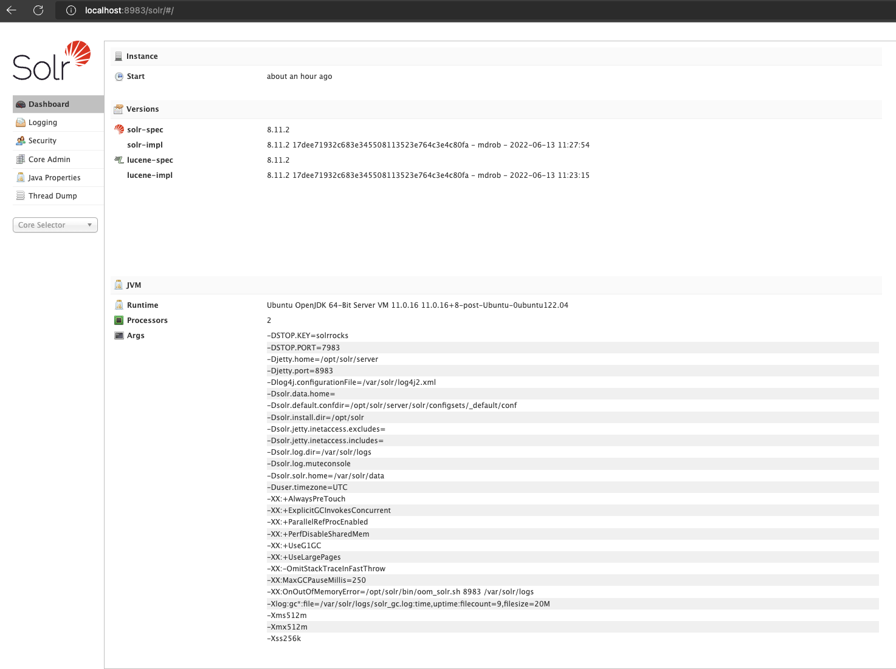
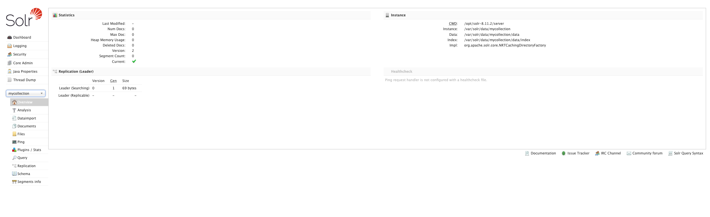

## Installing Apache Solr

Apache Solr is an open-source search platform written on Java. Solr provides full-text search, spell suggestions, custom document ordering and ranking, Snippet generation, and highlighting. Apache Solr runs as a standalone full-text search server. Its REST-like HTTP/XML and JSON APIs make it usable from most other popular programming languages.

### Prerequisites

#### Installing Java

Apache Solr 9 required Java 11 or greater version. We will install is by executi the following commands:

```zsh
sudo apt -y update
sudo apt -y install openjdk-11-jdk
```

Check for your active Java version with the following command:

```zsh
java -version
```

#### Installing Solr 

Now download the required Solr version from the PUL mirror to install on your sandbox using the following commands.

```zsh
wget https://lib-solr-mirror.princeton.edu/dist/lucene/solr/8.11.2/solr-8.11.2.tgz
tar xzf solr-8.11.2.tgz solr-8.11.2/bin/install_solr_service.sh --strip-components=2
sudo bash ./install_solr_service.sh solr-8.11.2.tgz  
```

#### Managing Solr Service

Solr is configured as a service on your system. You can simply use the following commands to Start, Stop and check the status of the Solr service.

To view the status of solr server, type the following commands:

```zsh
sudo systemctl status solr
```

Use following commands to stop, start and restart Apache solr service:

```zsh
sudo systemctl stop solr 
sudo systemctl start solr
sudo systemctl restart solr
```

#### Creating a Collection in Solr

Create the first collection in Apache Solr using the following command:

```zsh
sudo su - solr -c "/opt/solr/bin/solr create -c mycollection -n pul_example_solr"
```

#### Accessing the Solr Admin Panel

You will need to exit your sandbox and reconnect with a tunnelled connection with the following commands:

```zsh
exit
ssh -L 8983:localhost:8983 pulsys@sandbox-<yournetid>.lib.princeton.edu
```

The default Apache Solr runs on port 8983. So, you can access your Solr service to this port in your web browser using your computer's localhost with

```zsh
http://localhost:8983
```


Now, select “**mycollection**” under **Core Selector** drop down in left sidebar. This will show you the statics of the selected collection.

