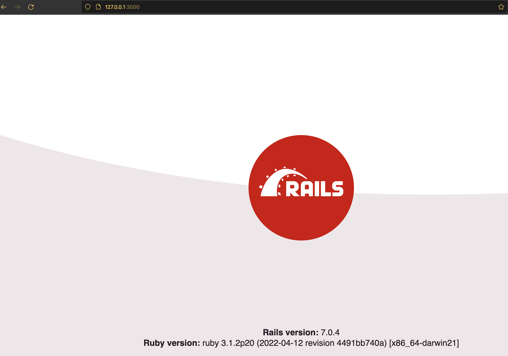
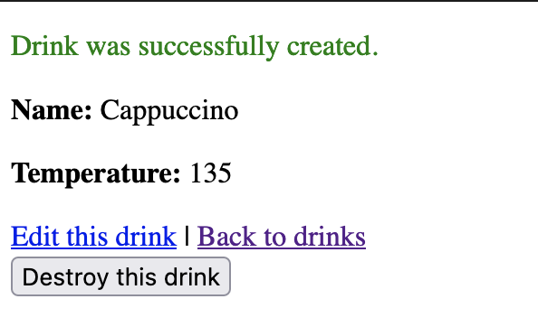

## Create A Rails App

From here on, this guide assumes you have Rails 7.0.x. To check your Rails version, type this in the terminal:

```zsh
rails -v
```

Approximate expected result:

```
Rails 7.0.4
```

The resulting text may differ. This is the version in fall of 2022

### Step 1: Change to your railsbridge directory

`cd` stands for change directory.

```zsh
cd ~/Documents/railsbridge
```

### Step 2: Create a new Rails app

Type this in the terminal:

```zsh
rails new test_app
```

The command's output is voluminous, and will take some time to complete, with a long pause in the middle, after all the 'create...' statements ending in 'bundle install'. When it fully completes, it will return you to your home prompt. Look for the 'Bundle complete!' message just above.

Type this in the terminal:

```zsh
cd test_app
```

Type this in the terminal:

```zsh
rails server
```

The first command should produce no output. If rails server starts up with no errors, you're golden! It'll look something like this:

Approximate expected result:

```
=> Booting Puma
=> Rails 7.0.4 application starting in development
=> Run `bin/rails server --help` for more startup options
Puma starting in single mode...
* Puma version: 5.6.5 (ruby 3.1.2-p20) ("Birdie's Version")
*  Min threads: 5
*  Max threads: 5
*  Environment: development
*          PID: 69776
* Listening on http://127.0.0.1:3000
* Listening on http://[::1]:3000
Use Ctrl-C to stop
```

If it does, congratulations! You've successfully installed Ruby AND Rails and started your server.

In your browser, go to `http://127.0.0.1:3000`



Back in the Terminal window where you ran rails server, type Control-C (don't type this into the console, but hold the Control and C keys at the same time) to kill(stop) the server.

### Step 3: Generate a database model

From the `test_app` directory. Type this in the terminal:

```zsh
rails generate scaffold drink name:string temperature:integer
```

Type this in the terminal:

```zsh
rails db:migrate
```

Type this in the terminal:

```zsh
rails server
```

Note: the above are three separate commands. Type each line into the terminal separately, not as one single command.

Wait until your console shows that the Puma server has started (just like before). Then, in the browser, visit http://localhost:3000/drinks

  1.  Click on "New drink"
  1.  Enter Cappuccino for the name
  1. Enter 135 for the temperature.
  1. Click on "Create Drink".

(The window where you ran rails server will display debugging information as you do this.)

You should see:



In your terminal, Hold Control and hit C to stop the rails server.